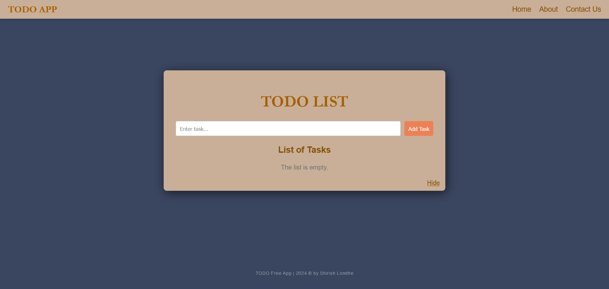

# TODO List Application

A simple and elegant TODO list application built using **HTML**, **CSS**, and **JavaScript**. This app helps users manage their daily tasks with features such as task addition, deletion, completion marking, inline editing, and task list animations.

## Features

- Add new tasks to the list.
- Edit tasks with inline editing functionality.
- Mark tasks as completed.
- Delete tasks from the list.
- Task list animations for showing and hiding the task list.
- Responsive design for better user experience.

## Technologies Used

- **HTML**
- **CSS**
- **JavaScript**

### TODO App Screenshot

You can try Live demo [here :)](https://shirishlondhe.github.io/TODO-List/)
